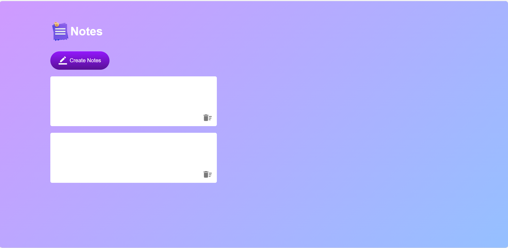

# Simple Notepad

Simple Notepad is a web-based note-taking application that allows users to create and manage their notes effortlessly. The application provides a clean and intuitive interface for a seamless note-taking experience.

## Project Structure

The project is organized with the following structure:

- **VS Code Folder**
  - `launch.json`: Configuration file for launching Chrome against localhost.

- **Images Folder**
  - `delete.png`: Image icon for deleting notes.
  - `edit.png`: Image icon for editing notes.
  - `notes.png`: Image icon for the application logo.

- **HTML File**
  - `index.html`: The main HTML file containing the structure of the notepad application.

- **JavaScript File**
  - `script.js`: JavaScript file responsible for handling note creation, deletion, and local storage management.

- **CSS File**
  - `style.css`: Cascading Style Sheets file defining the visual appearance of the notepad application.

## Usage

1. Open the `index.html` file in a web browser.
2. The application presents a title, a button for creating new notes, and a container for displaying existing notes.
3. Click the "Create Notes" button to add a new note.
4. Each note includes a contenteditable area for typing and an icon for deleting the note.
5. Pressing the "Enter" key inserts line breaks within the note.
6. Clicking the delete icon removes the respective note.
7. Notes are saved locally, ensuring persistence across sessions.

## Visual Preview

## Technologies Used

- HTML
- CSS
- JavaScript

## Contributing

Feel free to contribute to the project by creating issues, suggesting improvements, or submitting pull requests.

## License

This project is licensed under the [MIT License](LICENSE).

## Acknowledgments

- This project was inspired by Easy Tutorials' tutorial on building a notes app.

Enjoy using your Simple Notepad! 📝✨
